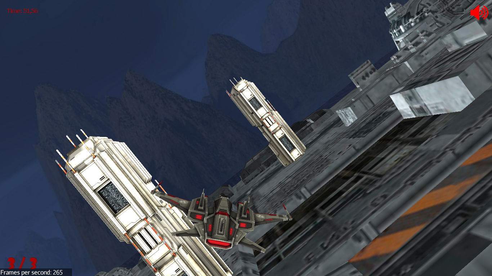

# JDefender

A Java 3D game with JMonkeyEngine as game engine.
This was funny project made some years ago with my friend [git-davi](https://github.com/git-davi).

<b>It was the first time for us in Object Oriented Programming, so sorry if the code is really bad! </b>

## Requirements

- Java 8 or greater
- JMonkey Engine

## Installation and run (for Ubuntu)

You can use the ant package to compile from the build.xml file

```
sudo apt-get install ant
ant
```

Or simply build the file from the JMonkey SDK

Run it and enjoy:

```
java -jar dist/MyGame.jar
```

